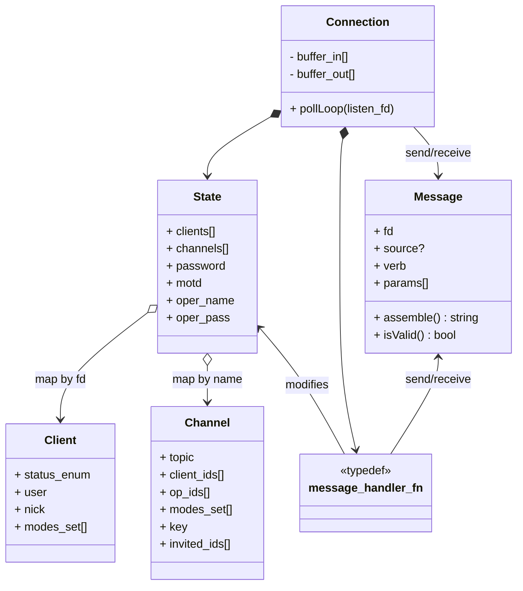
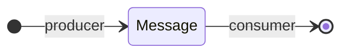
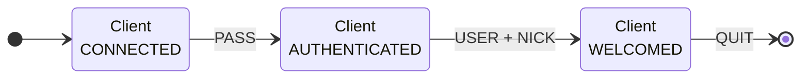
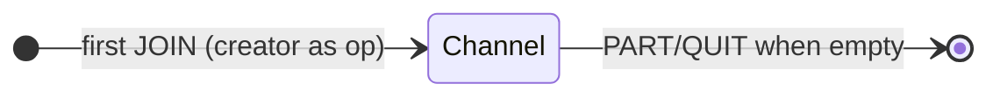

<div align="center">
  
</div>

# ft_irc

This is my ft_irc project: a single-server IRC implementation written in C++98 for Linux. It follows the core specifications of RFC 1459 and RFC 2812, supporting standard IRC features such as channels, nicknames, private messages, and operator commands.

We built the server from scratch as a team of three, handling everything from client socket management to message parsing and protocol compliance. The project required a strong focus on networking fundamentals: sockets, non-blocking I/O, multiplexing (poll), and stateful client handling.

Beyond the protocol itself, we had to define clean abstractions for users, channels, commands, and server state, while keeping tight control over memory and avoiding modern C++ conveniences. It was a solid crash course in network programming and system-level design using “old-school” C++.

## Table of Contents

- [About](#irc)
- [Requirements](#requirements)
- [Quick Start](#quick-start)
- [Example](#example)
- [Testing](#testing)
- [Features](#features)
- [Client Commands](#client-commands)
- [Bot](#bot)
- [Architecture](#architecture)
- [Implementation Notes](#implementation-notes)
- [Note on Project State](#note-on-project-state)
- [Credits](#credits)
- [License](#license)

## Requirements

- C++98 compliant compiler (g++, clang++)
- Linux operating system
- Make

## Quick Start

```bash
make
./ircserv <port> <password> ["message of the day"]
```

Connect with an IRC client such as [Irssi](https://irssi.org) :
```bash
irssi -c localhost -p <port> -w <password>
```

## Example

[ft_irc example](https://github.com/user-attachments/assets/d71e5cec-e779-453e-b14e-9cff86a6a9c3)

## Testing

```bash
make test
```

Tests cover parsing, authentication, channels, modes, and messaging.

## Features

- Non-blocking I/O with `poll()`
- Up to 200 concurrent connections
- Channel management (create, join, part, kick, invite)
- Channel modes: `+i` (invite-only), `+t` (topic restriction), `+k` (password), `+l` (user limit), `+o` (operator)
- Private messaging
- IRC operator privileges
- Comprehensive test suite
- Dice rolling bot

## Client Commands

### Essential
- `/nick <nickname>` - Set nickname
- `/join <#channel> [key]` - Join channel
- `/part <#channel>` - Leave channel
- `/msg <target> <message>` - Send private message
- `/quit [message]` - Disconnect

### Channel Management (operators only)
- `/kick <nick> [reason]` - Remove user
- `/invite <nick>` - Invite to channel
- `/topic [topic]` - View/set topic
- `/mode <#channel> <+/-flags> [params]` - Change modes

### Server
- `/motd` - Message of the day
- `/oper <name> <password>` - Gain IRC operator status

(Look into `hdrs/dictionary.hpp` to set the name and password for the operator)

## Bot

### Implementation

The bot (`clank` by default) automatically joins any channel a user joins.

It responds when:
- A channel message begins with its name (set in `dictionary.hpp`).
- A private message is sent to it.

After its name, it expects either:
- `info`
- a list of dice rolls

A limit of 100 rolls per dice type is set to avoid spamming.

### Example

```
/msg #channel clank info
/msg #channel clank d2 d4d6 2d8 6d20

or

/msg clank info
/msg clank d2 d4d6 2d8 6d20
```

## Architecture

The server uses a message-passing architecture with stateless handlers.



### Design Decisions

- **Function-based handlers**: Using `typedef void message_handler_fn(const Message &, State &, Responses &)` instead of interfaces eliminates inheritance boilerplate while maintaining composability and testability.
- **Direct state access**: Command handlers access state directly. This eliminates CRUD boilerplate and exception handling.
- **File descriptor as client id**: Uses socket FDs directly as client identifiers, simplifying mapping.
- **Object lifecycles**: Application objects are only in the stack, reducing the risk of memory leaks.

### Object Lifecycles

**Message**: Created when parsing input or generating responses. Consumed immediately. The `fd` field determines routing to/from clients.



**Client**: Created in `state.clients` map on first message. Progresses through states: CONNECTED → AUTHENTICATED (after PASS) → WELCOMED (after USER+NICK). Removed by QUIT handler.



**Channel**: Created in `State.channels` on first JOIN (creator becomes operator). Removed by PART/QUIT handlers when empty.



## Implementation Notes

* This server is built using standard POSIX socket APIs like `socket()`, `bind()`, `listen()`, `poll()`, `accept()`, `recv()`, `send()`, `close()`, and `fcntl()`.
* For a detailed breakdown of these functions, see the [Socket API Notes](docs/SOCKET_API_NOTES.md).
* The server does not use `getaddrinfo()`, it manually constructs `sockaddr_in` for simplicity.

## Note on Project State

All projects from my 42 cursus are preserved in their state immediately following their final evaluation. While they may contain mistakes or stylistic errors, I've chosen not to alter them. This approach provides a clear and authentic timeline of my progress and learning journey as a programmer.

## Credits

This project was developed in collaboration with two other students, my primary contributions to this project included the TUI (`banner.cpp`), the logging system (`Logs.class.*`, `BotLogs.class.*`), the core socket and connection logic (`Connection.class.*`, `socket.cpp`), and the bonus bot implementation (`handlers_bot.cpp`, `Rolls.class.*`).

## License

[MIT](https://choosealicense.com/licenses/mit/)  
