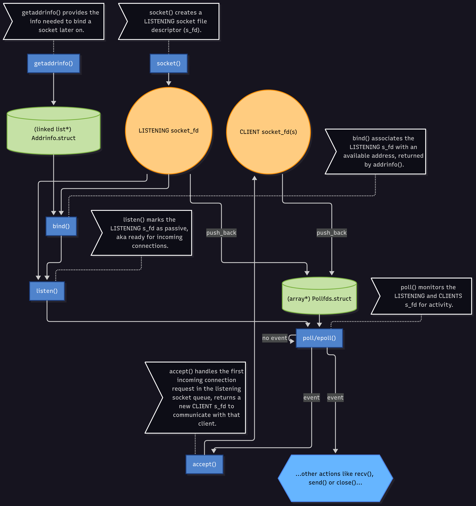

## Basic server functions overview



### Functions basic information

- ```getaddrinfo()```
```
    USECASE:
        int getaddrinfo(const char *node,
                const char *service,
                const struct addrinfo *hints,
                struct addrinfo **res);
		
        "getaddrinfo() is used to translate a server’s hostname or IP, and port, into usable socket addresses for binding and listening."

	INPUT:
        - node (const char *):
            Hostname or IP address (e.g. "www.google.com" or "127.0.0.1"). Can be NULL if you’re just binding locally.

        - service (const char *):
            Service name (like "http", "ftp", or port number as a string like "80").

        - hints (const struct addrinfo *):
            Pointer to a struct specifying preferences (address family, socket type, etc). Can be NULL.

        - res (struct addrinfo *):
            Pointer to a linked list of address results.

	RETURNED VALUE:
        - 0 (int) on success.
        - Error codes otherwise.

	NOTES:
        - Not necessary if you use a local address and known port, you can just fill the sockaddr struct manually.
        - Always zero-initialize hints (memset) before using.
        - Don’t free individual nodes; always free the entire list with freeaddrinfo().

	FREE:
        - YES, you need to free 'res' using:
            void freeaddrinfo(struct addrinfo *res);
```
  
- ```socket()```
```
    USECASE:
        int socket(int domain, int type, int protocol);

        "socket() creates an unbound endpoint (a socket) for communication and returns a file descriptor for it."

    INPUT:
        - domain (int):
            Communication domain (e.g., AF_INET for IPv4, AF_INET6 for IPv6).

        - type (int):
            Socket type (e.g., SOCK_STREAM for TCP, SOCK_DGRAM for UDP).

        - protocol (int):
            Protocol (usually 0 to let the system choose the default protocol based on the type).

    RETURNED VALUE:
        - File descriptor (int >= 0) on success.
        - -1 (int) on error (and errno is set).

    NOTES:
        - This is the very first step in setting up a server (or client).
        - The returned file descriptor (often called 'sockfd' or 'listen_fd') is used by all subsequent functions.

    FREE:
        - YES, you need to free the file descriptor using:
            int close(int fd);
```

- ```setsockopt()```
```
    USECASE:
        int setsockopt(int sockfd, int level, int optname,
                    const void *optval, socklen_t optlen);

        "setsockopt() is used to set various options on a socket, such as reusing addresses or ports."

    INPUT:
        - sockfd (int):
            The file descriptor of the socket.
        
        - level (int):
            The level at which the option is defined (e.g., SOL_SOCKET for socket-level options).
        
        - optname (int):
            The specific option to set (e.g., SO_REUSEADDR).
        
        - optval (const void *):
            Pointer to the value for the option (often a pointer to an int set to 1).
        
        - optlen (socklen_t):
            The size of the value pointed to by optval.

    RETURNED VALUE:
        - 0 (int) on success.
        - -1 (int) on error (and errno is set).

    NOTES:
        - This is technically optional but highly recommended for servers.
        - The most common use is setting SO_REUSEADDR, which allows the server to restart and bind to the same port quickly, avoiding "Address already in use" errors.

    FREE:
        - NO, this function modifies the state of an existing socket. No specific memory is allocated by this call that needs freeing.
```

- ```bind()```
```
    USECASE:
        int bind(int sockfd, const struct sockaddr *addr,
                socklen_t addrlen);
        
        "bind() assigns a local address (an IP and port) to a socket created by socket()."
    
    INPUT:
        - sockfd (int):
            The file descriptor of the socket to bind.
    
        - addr (const struct sockaddr *):
            Pointer to a sockaddr structure containing the address (IP and port) to bind to. This is often a 'struct sockaddr_in' or 'struct sockaddr_in6' cast to 'struct sockaddr *'.
    
        - addrlen (socklen_t):
            The size of the addr structure.
    
    RETURNED VALUE:
        - 0 (int) on success.
        - -1 (int) on error (and errno is set).
    
    NOTES:
        - This is essential for a server to define where it listens for connections.
        - The 'addr' struct is usually populated using the results from getaddrinfo() or filled manually.
    
    FREE:
        - NO, this function binds a system resource (port) to the socket. The resource is released when the socket is closed.
```

- ```listen()```
```
    USECASE:
        int listen(int sockfd, int backlog);
        
        "listen() marks a socket (that has been bound) as a passive socket, ready to accept incoming connections."
    
    INPUT:
        - sockfd (int):
            The file descriptor of the bound socket.
    
        - backlog (int):
            The maximum length of the queue for pending connections.
    
    RETURNED VALUE:
        - 0 (int) on success.
        - -1 (int) on error (and errno is set).
    
    NOTES:
        - This function only applies to SOCK_STREAM (TCP) sockets.
        - The 'backlog' tells the kernel how many connections to queue up while the server is busy handling an 'accept()'.
        - A common value for backlog is SOMAXCONN (a system-defined constant).
    
    FREE:
        - NO, this function changes the state of the socket from "connected" to "listening".
```

- ```poll()```
```
    USECASE:
        int poll(struct pollfd *fds, nfds_t nfds, int timeout);
        
        "poll() waits for an event (like incoming data) to occur on a set of file descriptors."
    
    INPUT:
        - fds (struct pollfd *):
            An array of 'pollfd' structures, specifying which FDs to watch and which events (e.g., POLLIN) to watch for.
    
        - nfds (nfds_t):
            The number of structures in the 'fds' array.
    
        - timeout (int):
            Time to wait in milliseconds. (-1 blocks indefinitely, 0 returns immediately).
    
    RETURNED VALUE:
        - Number (int > 0) of FDs with events on success.
        - 0 (int) if the timeout expired with no events.
        - -1 (int) on error (and errno is set).
    
    NOTES:
        - This is how a server monitors many clients (and the listen socket) at once without blocking on a single 'accept()' or 'recv()'.
        - After poll() returns, you must loop through the 'fds' array and check the 'revents' (returned events) field of each struct.
        - Alternatives include select() (older) and epoll() (Linux-specific, more performant).
    
    FREE:
        - NO, but you are responsible for managing the memory for the 'fds' array if you allocated it dynamically.
```

- ```accept()```
```
    USECASE:
        int accept(int sockfd, struct sockaddr *addr, socklen_t *addrlen);
        
        "accept() extracts the first pending connection from the listen queue and creates a new socket (file descriptor) for it."
    
    INPUT:
        - sockfd (int):
            The listening socket file descriptor (the one passed to listen()).
    
        - addr (struct sockaddr *):
            Pointer to a sockaddr struct. This gets filled by accept() with the client's address. (Can be NULL if you don't care).
    
        - addrlen (socklen_t *):
            Pointer to a socklen_t. Must be initialized to the size of 'addr'. It gets updated by accept() with the actual size. (Can be NULL if 'addr' is NULL).
    
    RETURNED VALUE:
        - New file descriptor (int >= 0) for the client connection on success.
        - -1 (int) on error (and errno is set).
    
    NOTES:
        - This is a blocking call by default (if the socket is blocking). It waits until a client connects.
        - The server uses the new file descriptor to recv() and send() with that specific client.
        - The original 'sockfd' (the listening socket) remains open, ready to accept() more connections.
    
    FREE:
        - YES, the new file descriptor returned by accept() must eventually be closed:
            int close(int fd);
```

- ```recv()```
```
    USECASE:
        ssize_t recv(int sockfd, void *buf, size_t len, int flags);
        
        "recv() is used to receive data from a connected socket (usually one returned by accept() or a connected client socket)."
    
    INPUT:
        - sockfd (int):
            The file descriptor of the connected socket (e.g., the one returned by accept()).
    
        - buf (void *):
            Pointer to a buffer to store the received data.
    
        - len (size_t):
            The maximum number of bytes to receive (the size of 'buf').
    
        - flags (int):
            Flags (usually 0 for default behavior).
    
    RETURNED VALUE:
        - Number of bytes (ssize_t > 0) received.
        - 0 (ssize_t) if the remote peer has closed the connection gracefully.
        - -1 (ssize_t) on error (and errno is set).
    
    NOTES:
        - This is a blocking call by default.
        - A return value of 0 is the only reliable way to know the client disconnected (for TCP).
        - 'recv()' might not read all 'len' bytes, even if more are available (e.g., in TCP).
    
    FREE:
        - NO, this function fills a buffer you provided. You are responsible for the 'buf' memory, not the function.
```

- ```send()```
```
    USECASE:
        ssize_t send(int sockfd, const void *buf, size_t len, int flags);
        
        "send() is used to transmit data to a connected socket."
    
    INPUT:
        - sockfd (int):
            The file descriptor of the connected socket.
    
        - buf (const void *):
            Pointer to the buffer containing data to send.
    
        - len (size_t):
            The number of bytes to send.
    
        - flags (int):
            Flags (usually 0 for default behavior).
    
    RETURNED VALUE:
        - Number of bytes (ssize_t > 0) actually sent.
        - -1 (ssize_t) on error (and errno is set).
    
    NOTES:
        - 'send()' might not send all 'len' bytes in one go (e.g., if the kernel's send buffer is full).
        - You must check the return value and loop if necessary to send the remaining data.
    
    FREE:
        - NO, this function reads from a buffer you provided.
```

- ```close()```
```
    USECASE:
        int close(int fd);
        
        "close() closes a file descriptor, releasing it and its associated resources back to the system."
    
    INPUT:
        - fd (int):
            The file descriptor to be closed (e.g., from socket() or accept()).
    
    RETURNED VALUE:
        - 0 (int) on success.
        - -1 (int) on error (and errno is set).
    
    NOTES:
        - This is used to close both the listening socket (when shutting down the server) and the client-specific sockets (when a connection is finished).
        - For TCP sockets, 'close()' initiates the graceful connection termination (FIN/ACK sequence).
        - Forgetting to close() file descriptors leads to a "resource leak."
    
    FREE:
        - NO, this is the 'free' function for file descriptors.
```
